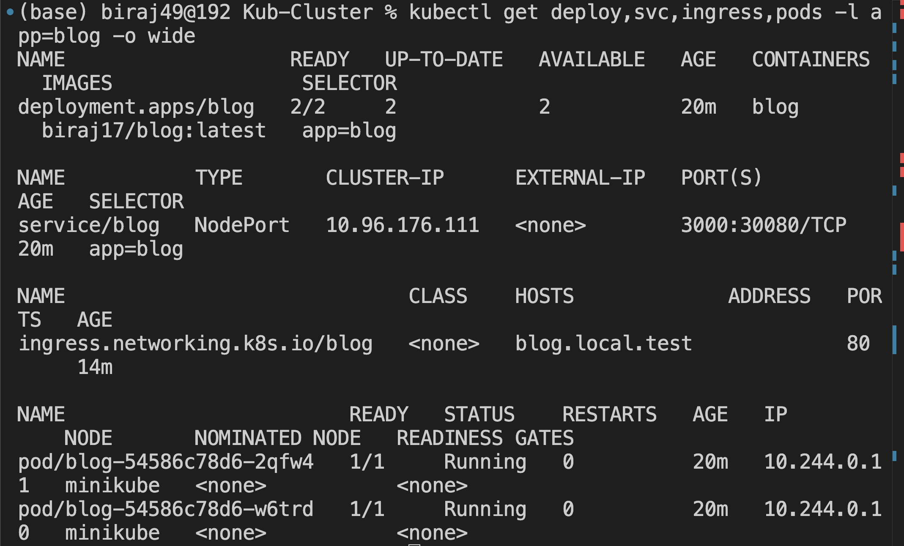
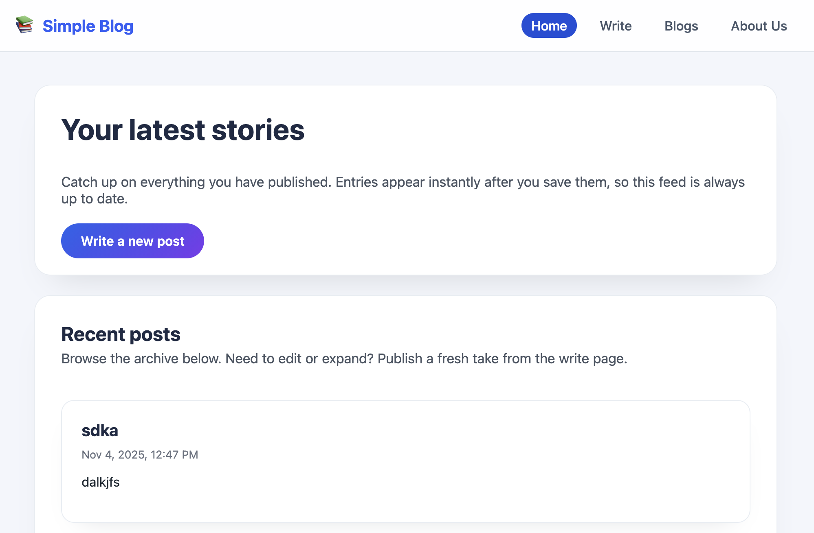

# Simple Next.js Blog

A minimal blog built with Next.js 14 App Router and PostgreSQL. Publish posts from the home page, view them on the blogs page, and learn more on the About Us page. Containerized the app and deployed it to a local Kubernetes cluster (Minikube) using Deployment, Service, and nginx Ingress manifests.

## Getting started

1. Install dependencies:

   ```bash
   npm install
   ```

2. Create a `.env.local` file in the project root and add your database URL. The value you supplied looks like:

   ```bash
   DATABASE_URL="postgresql://<user>:<password>@<host>/<database>?sslmode=require"
   ```
   Replace the placeholders with your actual managed Postgres connection string.

3. Start the development server:

   ```bash
   npm run dev
   ```

   Visit http://localhost:4000. Use the form on the home page to publish a blog post. New posts immediately appear on the `/blogs` page.

## Project structure

```
app/
├─ page.jsx            # Home page with blog submission form
├─ blogs/page.jsx      # Post listing
├─ about/page.jsx      # About us content
├─ components/Nav.jsx  # Shared navigation
├─ lib/db.js           # Postgres pool + table initializer
├─ lib/posts.js        # Data access + server actions
└─ globals.css         # Styling
```

## Deployment notes

- The application automatically creates the `blog_posts` table if it does not exist.
- Ensure `DATABASE_URL` is available in your hosting provider’s environment variables.
- For production, run `npm run build` followed by `npm start` (serves on port 4000 by default).

## Kubernetes deployment demo

Deployed the Dockerized blog to Minikube using Kubernetes Deployments, Services, and an nginx Ingress controller.



